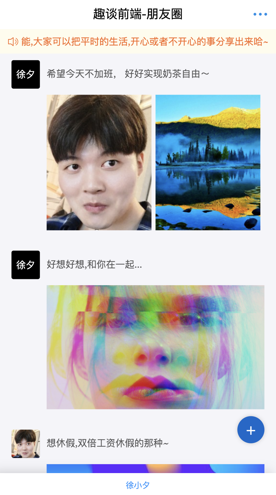
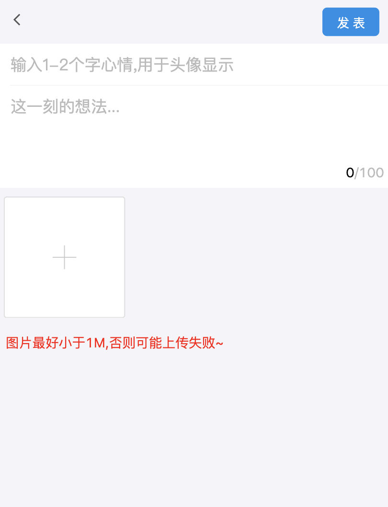

# wx-friendcircle
基于H5开发的仿微信朋友圈应用, 技术栈采用如下:
* 前端: react + umi + antd-mobile + react-lazyload + axios
* 后端: node + koa

## 基础服务支持平台
该朋友圈的数据功能均来自于笔者开发的CMS2.0版本, 目前准备开源, 敬请期待~
## demo演示
[在线地址](http://zhikume.cn/firendcircle)

## 部分截图

## 技术交流与反馈

